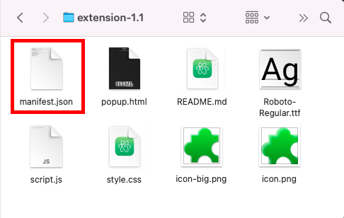

</img>

# Extension Template

Simple web browser extension kit. For small web devs like me :)

### Important!
When publish on a extension store or testing the extension, make sure the `manifest.json` is at the front of all the files before compressing. To accomplish this make sure the files are sorted by `none`.

